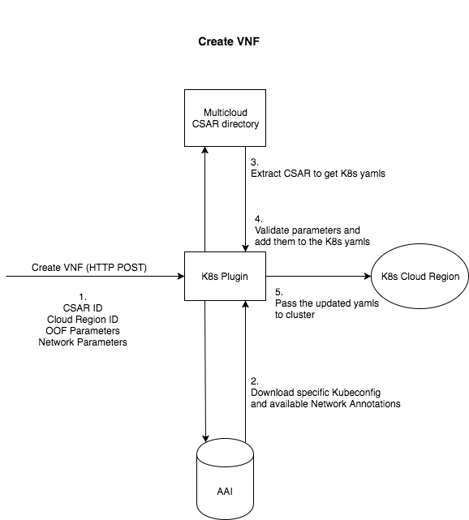
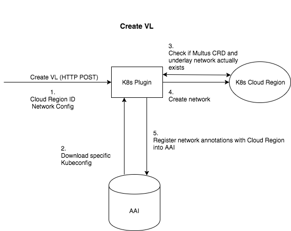

<!-- Copyright 2018 Intel Corporation.
Licensed under the Apache License, Version 2.0 (the "License");
you may not use this file except in compliance with the License.
You may obtain a copy of the License at
    http://www.apache.org/licenses/LICENSE-2.0
Unless required by applicable law or agreed to in writing, software
distributed under the License is distributed on an "AS IS" BASIS,
WITHOUT WARRANTIES OR CONDITIONS OF ANY KIND, either express or implied.
See the License for the specific language governing permissions and
limitations under the License. -->

# MultiCloud-k8s-plugin

MultiCloud Kubernetes plugin for ONAP multicloud. 
ONAP version: elalto 
GO: go version go1.13.3 linux/amd64 [Tuto install](https://medium.com/@patdhlk/how-to-install-go-1-9-1-on-ubuntu-16-04-ee64c073cd79)  
Helm: v2.15.0  
Docker server: 19.03.4, overlay2, cgroud driver: systemd

# Installation

Steps:

* Clone repo:
    * `git clone https://git.onap.org/multicloud/k8s`

* Build everything:
    *  `cd k8s/src/k8splugin && make all`

* Run Tests:
    *  `cd k8s/src/k8splugin && make test`

* Generate Coverage Report:
    * `cd k8s/src/k8splugin && make cover`

* Run the plugin:
    * `cd k8s/deployments && ./start.sh`

# Architecture

Create Virtual Network Function

Create Virtual Link

